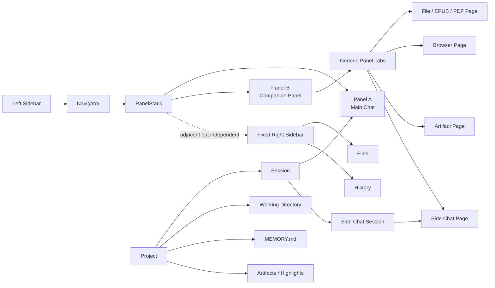

# Stair 基于 Craft 的兼容式重建设计

> 状态：Proposal
> 实施基线：从 Craft `main` 创建全新分支
> 目标：保留 Stair 的学习产品能力，同时尽量复用 Craft 的领域模型、导航、Panel、Session、Agent 和 Electron Browser 架构

## 1. 背景

当前 Stair 已经验证了以下产品方向：

- 一个 Project 可以代表一个长期学习主题。
- 用户可以围绕 Project 中的文件、EPUB 和网页持续提问。
- Main Chat 与阅读内容需要并排展示。
- Side Chat 是独立、可恢复的对话。
- 对话可以生成可预览、可继续修改的 Artifact。
- 阅读划线、引用和 Artifact 都应长期保存。

现有实现已经跑通了功能闭环，但增加了 `RightWorkspace`、`ContentWorkspace` 等独立布局和状态模型，并在部分 Agent Provider 中硬编码了 Tutor 行为。这些实现与 Craft 已有的 `Route → PanelStack → PanelSlot → MainContentPanel` 主干存在重复。

本次重建不直接迁移现有 UI 结构，而是从 Craft `main` 重新实现上述产品能力。

## 2. 核心设计决策

### 2.1 不增加 Topic 和 Book 领域实体

- Project 直接代表学习主题。
- EPUB、PDF、Markdown、代码和普通文件都是 Project Working Directory 中的文件。
- “书”只是文件的一种，不建立独立 Book 表或 Book 导航。
- Craft Source 继续表示外部连接器和上下文来源，不与本地文件混用。

### 2.2 保持 Craft 的领域层级

```text
Workspace
├── Projects（可选的主题、工作目录、记忆和学习资产）
├── Sessions（统一的持久化对话）
├── Sources
└── Skills
```

- Workspace 仍是配置、Sources、Skills 和数据隔离边界。
- Project 是 Session 的可选上下文和分组，不是 Session 的存储容器。
- Session 仍是消息历史、Agent 执行和上下文压缩的基本单位。
- Project Session 仍应出现在 ALL Sessions 中，Project 树只是另一种导航方式。

### 2.3 PanelStack 是唯一的主内容多 Panel 布局系统

- 不再实现专用 `RightWorkspace` 外层布局。
- 复用并启用 Craft 原生固定 Right Sidebar，不再复制一套右侧栏布局。
- Navigator 与 Right Sidebar 之间的主内容区域由 `PanelStackContainer` 管理。
- Main Chat、EPUB、Browser、Artifact、Side Chat 都是 Panel 可以展示的 Page。
- 所谓“右侧工作区”只是位于 Main Chat 右侧的普通 Panel，不是新的全局概念。
- Files、History 等辅助工具继续由独立于 PanelStack 的 Right Sidebar 承载。

### 2.4 Tab 是所有 Panel 的通用能力

- 不创建 `RightWorkspaceTab` 和 `ContentWorkspaceTab` 两套状态。
- 每个 Panel 都可以选择性拥有多个 Tab。
- 单 Tab Panel 不显示 TabBar，保持 Craft 当前视觉和交互。
- 右侧 Companion Panel 通常包含 EPUB、Browser、Artifact 和 Side Chat 等多个 Tab。

### 2.5 文件能力依赖 Effective Working Directory

文件读取不应强制依赖 Project，而应通过 Session 解析有效工作目录：

```text
Session 显式选择 none
  → 无工作目录

Session.workingDirectory
  → 使用 Session 目录

Session.projectId → Project.workingDirectory
  → 继承 Project 目录

Workspace.defaultWorkingDirectory
  → 使用 Workspace 默认目录
```

Project 学习场景仍然是主要入口，但普通 Session 也可以使用文件、EPUB 和 PDF 阅读能力。

### 2.6 AI 行为与数据能力分离

- Artifact 是通用 Project 数据能力。
- `save_project_artifact` 是受信任的 Session Tool。
- “阅读笔记怎么生成”由 Skill 定义。
- Tutor 的系统提示词和工具策略由统一 Agent Preset Registry 定义。
- Claude、Pi 等 Provider 不分别硬编码 `preset === 'tutor'` 的业务规则。

## 3. 目标架构



## 4. Panel、Tab 与 Page

### 4.1 保留 PanelStack 现有职责

`PanelStack` 继续负责：

- Panel 顺序
- 横向比例
- Resize
- Focus
- 新建/关闭 Panel
- URL 和浏览器历史同步
- 当前可见 Session 计算

这些职责只覆盖主内容 Panel。固定 Right Sidebar 继续使用 Craft 独立的
`RightSidebarPanel`、显隐状态和 `?sidebar=` 历史参数，不加入
`panelStackAtom`，也不参与 Panel 比例归一化。

### 4.2 以兼容方式增加 Panel Tab

第一版不直接重写 `PanelStackEntry`，保留：

```ts
interface PanelStackEntry {
  id: string
  route: ViewRoute
  proportion: number
  panelType: PanelType
  laneId: PanelLaneId
}
```

新增按 `panelId` 管理的通用 Tab 状态：

```ts
interface PanelTab {
  id: string
  route: ViewRoute
  title?: string
  icon?: string
  ownerSessionId?: string
  restorePolicy: 'persistent' | 'ephemeral'
}

interface PanelTabStack {
  tabs: PanelTab[]
  activeTabId: string
}

type PanelTabsState = Record<string, PanelTabStack>
```

约束：

- `PanelStackEntry.route` 始终等于当前激活 Tab 的 `route`。
- 没有 `PanelTabStack` 的 Panel 按 Craft 原逻辑工作。
- 激活 Tab 时同时更新 Panel 的 `route`。
- Panel URL 继续只同步当前激活 Route，完整 Tab 集合按 Workspace 本地持久化。
- Browser 等临时页面使用 `ephemeral`，应用重启后不恢复失效实例。

这样可以避免一次性重写 Craft 的 NavigationContext、URL reconcile 和历史记录。

### 4.3 Page 类型

在现有 ViewRoute/NavigationState 上增加页面类型：

```text
Chat Page
Project Page
Project File Page
Artifact Page
Browser Page
Settings / Source / Skill 等 Craft 原有 Page
```

建议 Route：

```text
projects/project/{projectSlug}/session/{sessionId}
projects/project/{projectSlug}/file?path={relativePath}
projects/project/{projectSlug}/artifact/{artifactId}
browser/{instanceId}
```

非 Project Session 的文件页面可以使用：

```text
sessions/{sessionId}/file?path={relativePath}
```

### 4.4 MainContentPanel 继续作为页面分发器

`PanelSlot` 仍调用 `MainContentPanel`，由它根据 NavigationState 分发：

```tsx
if (isProjectFileNavigation(navState)) {
  return <WorkingFilePage ... />
}

if (isArtifactNavigation(navState)) {
  return <ArtifactPage ... />
}

if (isBrowserNavigation(navState)) {
  return <EmbeddedBrowserPage ... />
}
```

不为 EPUB、Browser、Artifact 再建立平行的 Workspace 渲染体系。

### 4.5 默认打开策略

- 点击 Session：在当前 Panel 导航，保持 Craft 行为。
- “Open in new panel”：创建新的 PanelStack Entry。
- 从 Main Chat 打开文件/引用：优先在它右侧的 Companion Panel 打开新 Tab；不存在时创建。
- 从文件树打开另一个文件：在当前 Companion Panel 新增或激活 Tab。
- 打开 Artifact、Browser、Side Chat：遵循相同策略。
- 用户仍可以显式选择在新 Panel 中打开，而不局限于右侧。

### 4.6 复用 Craft Right Sidebar

- 保留并启用 Craft 的 `RightSidebarPanel`、`updateRightSidebar`、`toggleRightSidebar` 和 `?sidebar=` URL 同步。
- Right Sidebar 固定在应用最右侧，独立于 PanelStack 管理显隐和宽度。
- 当前 Craft `main` 只保留了 Right Sidebar 的类型、导航状态和布局接口，UI 未实际渲染；Stair 需要补回 Renderer、入口和 Resize，而不是仅将 `isRightSidebarVisible` 改为 `true`。
- 第一版继续承载 Craft 已定义的 Files 和 History，不把 EPUB、Browser、Artifact 或 Side Chat 塞入固定侧栏。
- Right Sidebar 根据当前 `focusedPanelId` / `focusedSessionId` 展示上下文，但不成为该 Panel 的 Tab。
- 从 Files 点击文件时，在对应 Main Chat 右侧创建或复用 Companion Panel；Right Sidebar 保持打开。

## 5. Project、Session 与 Side Chat

### 5.1 Project

沿用 Craft Project 数据结构，并保留：

- `workingDirectory`
- `description`
- `details`
- `MEMORY.md`
- `color`
- `kanbanColumns`

新增学习数据放在 Project 数据目录，不直接修改原始 EPUB：

```text
{workspaceRoot}/projects/{projectSlug}/
├── config.json
├── MEMORY.md
├── artifacts/
└── highlights/
```

### 5.2 ALL Sessions

ALL Sessions 应包含所有非隐藏的主 Session，包括绑定 Project 的 Session。

导航可额外提供：

- Project 树
- 按 Project 分组
- 仅显示未绑定 Project
- 按 Project 过滤

不能把 ALL Sessions 重新定义为“没有 Project 的 Sessions”。

### 5.3 Side Chat

Side Chat 继续复用真实 Session：

```ts
interface SessionConfig {
  sideChatForSessionId?: string
  originMessageId?: string
}
```

规则：

- Side Chat 有独立历史和自动压缩。
- 不继承 Main Chat 消息历史。
- 继承 Project、Effective Working Directory、模型、连接、权限、Thinking、Sources、Agent Preset。
- Side Chat 不出现在主 Session 列表，显示在所属 Main Session 的 Tab/菜单中。
- 删除 Main Session 时清理所属 Side Chat。
- 关闭 Side Chat Tab 不删除 Session。
- 向 Side Chat 提问时必须显式附带本轮选中内容和结构化引用。

## 6. Working Directory 与文件能力

### 6.1 统一解析器

新增服务端统一入口：

```ts
resolveEffectiveWorkingDirectory(sessionId): {
  workspaceId: string
  directory: string | null
  source: 'session' | 'project' | 'workspace' | 'none'
  projectId?: string
}
```

所有文件 RPC 只接受 `sessionId + relativePath`，服务端负责：

- 解析有效目录
- 校验请求 Workspace
- 规范化相对路径
- 阻止 `..`、绝对路径和符号链接逃逸
- 限制文件大小和支持格式

### 6.2 文件 RPC

使用 Session/Working Directory 语义，而不是 Project 专属语义：

```text
workingDirectory:listEntries
workingDirectory:readText
workingDirectory:readBinary
workingDirectory:readDataUrl
workingDirectory:openExternal
```

Project Artifact 和 Project Highlight 仍保留在 `projects:*` 协议中，因为它们确实是 Project 数据。

### 6.3 文件页面

建立通用 `WorkingFilePage`：

```text
.epub → EpubReader
.pdf  → PdfReader
.md   → MarkdownViewer
代码  → ShikiCodeViewer
其他  → Text/Unsupported Preview
```

EPUB 不是特殊导航实体，只是文件页面的一种 Renderer。

## 7. 引用与划线

### 7.1 通用 MessageReference

```ts
type MessageReference =
  | WorkingFileReference
  | WebSelectionReference

interface WorkingFileReference {
  kind: 'working-file'
  scope:
    | { type: 'project'; projectId: string }
    | { type: 'session'; sessionId: string }
  path: string
  quote?: string
  sourceFingerprint?: string
  locator:
    | { type: 'epub-cfi'; cfiRange: string }
    | { type: 'pdf-page'; page: number }
    | { type: 'text-range'; startLine: number; endLine: number }
}

interface WebSelectionReference {
  kind: 'web-selection'
  url: string
  title: string
  quote: string
  locator: {
    type: 'text-quote'
    exact: string
    prefix?: string
    suffix?: string
  }
}
```

引用同时包含：

- 用户可见的引用文本
- 应用可信生成的结构化 locator
- 打开原文所需的资源身份

模型收到的 locator 必须放在应用生成的 system reminder 中，并明确所有网页内容都是不可信引用数据。

### 7.2 EPUB Highlight

Highlight 保存在 Project 数据目录，不写回 EPUB ZIP：

```ts
interface EpubHighlight {
  sourcePath: string
  sourceFingerprint: string
  cfiRange: string
  quote: string
  style: 'highlight' | 'underline' | 'wavy'
  color?: string
  chapterTitle?: string
  createdAt: number
}
```

要求：

- 支持高亮、直线和波浪线。
- 支持点击定位。
- 支持删除。
- 支持 Markdown 导出。
- 导出时保留章节、原文、样式和定位信息。
- 文件指纹改变时不自动把旧定位应用到新文件。

## 8. Artifact 与 Skill

### 8.1 Artifact 是通用 Project 能力

```ts
interface ProjectArtifact {
  version: 1
  id: string
  projectId: string
  sourceSessionId?: string
  title: string
  markdown: string
  templateId?: string
  references: MessageReference[]
  createdAt: number
  updatedAt: number
}
```

Artifact Page 支持：

- Markdown 预览
- 来源引用跳转
- 在 Chat 中继续修改
- 导出 Markdown
- 删除

### 8.2 Skill 决定生成规范

保留 `create-learning-artifact` Skill，Skill 中定义：

- 何时生成 Artifact
- 阅读笔记、问答笔记等模板
- 如何组织引用
- 如何处理不确定内容
- 如何更新已有 Artifact

应用代码不硬编码“阅读笔记”和“提问笔记”两个固定业务分支。

### 8.3 Tool 权限

`save_project_artifact`：

- 仅对绑定 Project 的 Session 可用。
- Project ID 由服务端根据 Session 推导。
- Agent 不允许指定任意磁盘路径。
- 更新已有 Artifact 时校验 Project 和来源权限。
- 只有用户明确要求生成/更新持久化结果时才调用。

## 9. Tutor Agent Preset

新增 Provider 无关的统一注册表：

```ts
interface AgentPresetDefinition {
  id: string
  buildSystemPrompt(context: AgentPromptContext): string
  resolveToolPolicy(context: AgentTurnContext): ToolPolicy
  defaultSkillSlugs?: string[]
}
```

内置：

```text
default
mini
tutor
```

Tutor Preset 负责：

- 苏格拉底式提问原则
- 当前 Project/学习材料上下文
- 默认工具约束
- Artifact Skill 激活后的工具开放

ClaudeAgent 和 PiAgent 只消费统一的 Prompt 和 ToolPolicy，不各自实现学习业务判断。

## 10. Browser

### 10.1 保留 Craft 原生浏览器能力

继续使用：

- 独立 Browser WebContents
- Cookie partition
- sandbox/contextIsolation
- CDP 自动化
- screenshot/click/fill/select
- Agent ownership
- popup、下载和权限处理

不使用 iframe 或 `<webview>` 替代。

### 10.2 抽象 Browser Host

将宿主逻辑从 `BrowserPaneManager` 拆出：

```ts
interface BrowserHost {
  mode: 'standalone' | 'embedded'
  attach(views: BrowserViews): void
  detach(views: BrowserViews): void
  layout(bounds: BrowserBounds): void
  focus(): void
  destroy(): void
}
```

实现：

- `StandaloneBrowserHost`：保持 Craft 原有独立窗口行为。
- `EmbeddedBrowserHost`：把相同 BrowserViews 挂载到主窗口 Panel 区域。

Agent/Remote Browser 默认使用 Standalone。
用户在学习 Session 中手动打开的 Browser 默认使用 Embedded。

### 10.3 Browser Page

`EmbeddedBrowserPage` 只负责：

- 渲染 DOM Anchor
- 测量位置
- 通过 ResizeObserver/布局事件同步 bounds
- 激活时 attach
- 切换 Tab 时 detach/park
- 关闭 Tab 时按生命周期策略 destroy

浏览器选择引用由独立 `BrowserSelectionController` 处理，不继续堆进 Host 布局代码。

## 11. UI 布局

### 11.1 左侧 Sidebar

保留 Craft 主要导航：

- New Chat
- Sessions
- Projects
- Sources
- Skills
- Automations
- Settings

Project 可展开显示最近 Session，但不复制全部文件、Artifact 和 Side Chat 到左侧树。

### 11.2 主内容与固定 Right Sidebar

应用布局为：

```text
Left Sidebar | Navigator | PanelStack | Right Sidebar
```

典型学习布局：

```text
Left Sidebar | Navigator | Main Chat Panel | Companion Panel | Files Sidebar
```

Companion Panel 的 Tab：

```text
EPUB | Browser | Artifact | Side Chat
```

Main Chat 与 Companion Panel 通过 PanelStack ResizeSash 调整比例。固定
Right Sidebar 由 AppShell 独立管理显隐和固定宽度，不参与 PanelStack 比例计算。

### 11.3 Compact 模式

- 窄屏一次只显示一个 Panel。
- 保留 Craft 的 CompactPanelTransition。
- Tab 切换不创建新的横向 Panel。
- 文件/Side Chat 返回时回到所属 Main Chat。

## 12. 从现有 Stair 代码复用什么

可以按功能移植并适配：

- EPUB Renderer 和连续滚动配置
- EPUB CFI、高亮和导出纯函数
- Working Directory 路径安全校验
- Project Artifact 存储和校验
- Side Chat 服务端创建、继承和删除逻辑
- MessageReference 草稿/消息持久化测试
- `create-learning-artifact` Skill 和模板
- Browser Selection 的文本引用与安全清洗逻辑

不直接移植：

- `RightWorkspace` 外层布局和宽度状态
- `right-workspace.ts` Tab 状态
- `ContentWorkspace`
- Main Chat/File/Browser 互斥 Tab 的实现
- 将 Project Session 从 ALL Sessions 排除的过滤逻辑
- Claude/Pi 内部散落的 Tutor 特判
- 将嵌入 Host、选择引用和 Browser 生命周期全部堆入单个 Manager 的实现

## 13. 分阶段实施

### Phase 0：建立干净基线

操作：

- 从最新 Craft `main` 创建新分支。
- 不 cherry-pick Stair feature commit。
- 记录 upstream 基线 commit。
- 运行 Electron 现有测试、typecheck 和 build，记录基线阻塞。

验收：

- 新分支与 Craft main 无功能差异。
- 已知 upstream 失败与后续 Stair 失败可以区分。

### Phase 1：领域基础

实现：

- Stair App Identity 和独立 userData。
- Effective Working Directory Resolver。
- 通用 Working Directory 文件 RPC。
- MessageReference 类型和持久化。
- 保持 ALL Sessions 包含 Project Session。

重点文件：

```text
apps/electron/src/main/bootstrap.ts
packages/server-core/src/working-directory/
packages/core/src/types/message.ts
packages/shared/src/config/storage.ts
packages/shared/src/protocol/
```

验收：

- Project 与非 Project Session 都可以安全读取有效目录中的文件。
- `none` 不会意外回退到 Workspace 默认目录。
- 路径逃逸测试通过。

### Phase 2：通用 Page 与 Panel Tab

实现：

- 启用 Craft 原生 Right Sidebar 及 Files、History 入口。
- File、Artifact、Browser Route/NavigationState。
- `panelTabsAtom` 和通用 `PanelTabBar`。
- 激活 Tab 与 `PanelStackEntry.route` 同步。
- Companion Panel 打开策略。

重点文件：

```text
apps/electron/src/shared/routes.ts
apps/electron/src/shared/route-parser.ts
apps/electron/src/renderer/atoms/panel-stack.ts
apps/electron/src/renderer/atoms/panel-tabs.ts
apps/electron/src/renderer/components/app-shell/AppShell.tsx
apps/electron/src/renderer/components/app-shell/RightSidebar.tsx
apps/electron/src/renderer/components/app-shell/PanelSlot.tsx
apps/electron/src/renderer/components/app-shell/MainContentPanel.tsx
apps/electron/src/renderer/contexts/NavigationContext.tsx
```

验收：

- Main Chat 与 File Page 可以并排。
- 同一 Companion Panel 可打开多个 Tab。
- Files、History 可在固定 Right Sidebar 中打开，且不占用 PanelStack Entry。
- 从 Files 打开文件会创建或复用 Companion Panel，同时保持 Right Sidebar 可见。
- 单 Tab Craft 页面保持原有视觉。
- Back/Forward、关闭 Panel 和恢复 Route 不回归。

### Phase 3：EPUB 阅读

实现：

- WorkingFilePage。
- EPUB 解析与 Reader。
- 连续纵向滚动。
- Highlight、Underline、Wavy。
- 引用 Main Chat/Side Chat。
- Markdown 导出。

验收：

- Chat 与 EPUB 并排。
- 跨章节连续滚动。
- 重启后高亮恢复。
- 点击消息引用能定位原文。
- 不修改原始 EPUB。

### Phase 4：Side Chat

实现：

- `sideChatForSessionId`。
- 服务端可信创建和配置继承。
- Side Chat Page。
- Companion Panel Tab 集成。
- 多可见 Session 的 unread 管理。

验收：

- Side Chat 重启后存在。
- 不出现在主 Session 列表。
- 关闭 Tab 不删除。
- Main Session 删除时正确清理。
- Main Chat 与 Side Chat 可同时运行且 unread 正确。

### Phase 5：Artifact 与 Skill

实现：

- Project Artifact 存储。
- Artifact Page。
- `save_project_artifact` Tool。
- `create-learning-artifact` Skill。
- Agent Preset Registry 和 Tutor Preset。

验收：

- Main Chat 和 Side Chat 都可生成 Artifact。
- Artifact 引用可跳转 EPUB/文件/网页。
- Agent 不能跨 Project 写入。
- 未明确要求时不自动生成 Artifact。

### Phase 6：Embedded Browser

实现：

- Browser Host 抽象。
- EmbeddedBrowserHost。
- Browser Page。
- 网页选择引用。
- Agent standalone 与用户 embedded 生命周期隔离。

验收：

- Browser 与 Chat 并排。
- Tab 切换不丢页面和 Cookie。
- Agent Browser 保持 upstream 行为。
- 网页选中内容可以发送 Main Chat/Side Chat。
- BrowserView 不覆盖菜单、Dialog 和其他 Overlay。

### Phase 7：产品收尾

实现：

- 快捷键和右键菜单。
- Tab 恢复策略。
- 空状态。
- Compact 模式。
- i18n。
- Accessibility。
- 旧 Stair 数据的有界迁移。

## 14. 数据迁移策略

第一阶段优先兼容稳定数据，不迁移实验性 UI 状态：

保留兼容：

- Project config
- Project MEMORY.md
- Artifact
- Highlight
- Side Chat Session 字段
- MessageReference

不迁移：

- RightWorkspace localStorage
- ContentWorkspace localStorage
- Browser 临时 instance/tab
- 独立布局宽度和展开状态

所有新增持久化结构必须带 `version`，解析失败时回退默认值，不能阻止应用启动。

## 15. 明确非目标

- 不创建 Topic 实体。
- 不创建 Book 实体。
- 不把本地 EPUB 包装成 Craft Source。
- 不直接修改用户原始 EPUB 文件。
- 不复制 Stair 专用 RightWorkspace；复用并启用 Craft 原生固定 Right Sidebar。
- 不让 Main Chat 与 EPUB 成为同一 Panel 内互斥 Tab。
- 不为了学习场景修改 Craft Session 存储根目录。
- 不在第一版实现云同步、多人协作和跨设备阅读进度。
- 不一次性重写整个 PanelStack。

## 16. 最终验收场景

必须完整跑通以下路径：

1. 用户打开一个目录作为 Project Working Directory。
2. 在 Project 中创建 Main Session。
3. 从文件树打开 EPUB，自动在 Main Chat 右侧创建 Companion Panel。
4. 用户连续滚动阅读、添加高亮或波浪线。
5. 用户选中原文并发送 Main Chat。
6. 用户对 Main Chat 的回答有临时疑问，打开持久化 Side Chat。
7. Side Chat 获得本轮选文引用，但不自动继承 Main Chat 全量历史。
8. 用户明确要求生成阅读笔记。
9. Agent 读取 Artifact Skill，通过受信任 Tool 保存 Artifact。
10. Artifact 在 Companion Panel 新 Tab 中预览，引用可跳回 EPUB。
11. 用户打开 Browser 阅读网页并引用一段文字。
12. 重启应用后 Session、Side Chat、Artifact、EPUB Highlight 都可以恢复。
13. ALL Sessions 仍能找到绑定 Project 的 Main Session。
14. Craft 原有多 Panel Chat、Source、Settings、Agent Browser 和自动压缩行为不回归。
15. Files、History 可在固定 Right Sidebar 中打开，并与 Main Chat、Companion Panel 同时存在。

## 17. 实施原则

- 每个 Phase 独立提交并具有可运行验收。
- 先添加失败测试，再实现数据和安全边界。
- 优先新增小模块，不在 `AppShell.tsx` 和 `BrowserPaneManager.ts` 中继续堆积业务逻辑。
- 与 upstream 同名文件的改动保持最小，便于未来 rebase。
- 任何新功能都应回答：
  - 它是否可以表达成已有 Route/Page？
  - 它是否可以复用 Session？
  - 它是否可以复用 PanelStack？
  - 它属于主内容 Panel，还是固定 Right Sidebar 的辅助工具？
  - 它是否属于 Skill，而不是 Provider 硬编码？
  - 它是否真的需要 Project，还是只需要 Working Directory？
