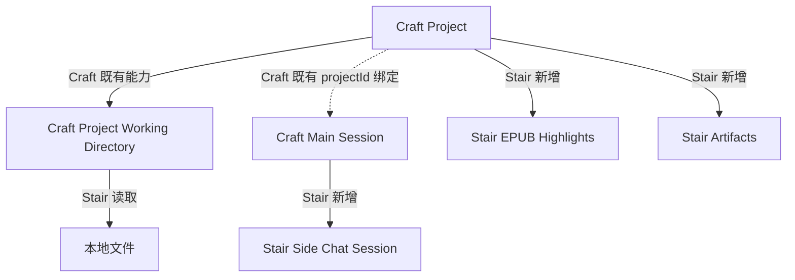

# Stair 当前实现需求文档

> 文档类型：当前实现快照 / 反向需求说明
>
> 快照日期：2026-07-27
>
> 代码基线：`codex/socratopia-learning`，HEAD `fbdcb59`
>
> 适用范围：当前仓库已提交实现，以及快照时工作区内尚未提交的浏览器与内容工作区实现

## 1. 文档目的

本文档把 Stair 当前代码中已经存在的产品行为整理成可验证的需求基线，回答四个问题：

1. Stair 在 Craft 基线上新增或改变了什么，用户现在能够完成什么；
2. Project、Session、文件、引用、Side Chat 与 Artifact 如何关联；
3. 数据存在哪里，边界和安全约束是什么；
4. 哪些能力只是工作区实现或底层基础设施，尚不能视为正式交付。

本文档不是未来架构方案。未来希望将文件、浏览器、聊天统一为 Craft Panel 的设计，仍以 `STAIR_CRAFT_ALIGNED_DESIGN.md` 为准。

### 1.1 Craft 基线与本文范围

Stair 基于 Craft Agent 当前能力构建。Workspace、Project、Session、Agent/Provider、工具执行、PanelStack、权限控制和自动压缩等能力默认沿用 Craft，不作为 Stair 的新增产品需求重复定义。其中 Project 的创建、编辑、Working Directory、Session 绑定与分组和删除解绑语义均属于 Craft 基线。

后文只有在以下情况才会提及 Craft 原有能力：

1. Stair 对该行为进行了新增、修改或限制；
2. Stair 依赖该行为形成明确的兼容性约束；
3. 当前实现与 Craft 基线存在分叉、回归风险或尚未完成的架构迁移。

因此，文中出现 Craft 能力时，只用于说明 Stair 的差异和边界，不表示 Stair 需要重新实现该能力。

## 2. 状态口径

后续需求使用以下状态，避免把“代码存在”误写成“产品已交付”。

| 标记 | 含义 |
| --- | --- |
| `[HEAD]` | 已进入当前分支 HEAD，可作为当前提交基线 |
| `[WORKTREE]` | 当前工作区已有实现，但尚未提交；仍需要完整 Electron 运行时验收 |
| `[INFRA]` | 底层类型、提示词或工具策略已存在，但当前没有完整、可达的产品入口 |

## 3. 产品目标

Stair 复用 Craft 现有 Project 与 Session，在其上增加学习工作区，使用户能够：

- 把 Project 已配置的 Working Directory 作为本地学习资料来源；
- 阅读本地 EPUB、PDF、Markdown、图片和代码/文本文件；
- 把原文位置作为结构化引用带入主聊天或 Side Chat；
- 保存 EPUB 划线并在不同会话间恢复；
- 将对话结果保存为 Project Artifact；
- 在当前工作区实现中，把手动浏览器页面和网页选文带入同一学习流程。

## 4. Stair 对 Craft 领域模型的扩展

Workspace、Project 和 Session 都是 Craft 已有领域对象。下图只展示 Stair 如何复用既有 Project/Session 关系，并接入资料、Side Chat、划线与 Artifact。

### 4.1 Project 上的 Stair 扩展

- Stair 不创建第二套“学习项目”模型，直接复用 Craft Project 的 ID、配置、Working Directory 和生命周期。
- Stair 将 Project 当前 `workingDirectory` 作为文件浏览、预览和 EPUB 解析的资料根，不再使用 Craft 原有 Project Assets 作为学习资料入口。
- Stair 在 Project 内新增 Artifact 与 EPUB 划线数据；这些数据随 Project 内部数据目录一起管理。
- Stair 不改变 Project 对 Session 的既有所有权关系。

### 4.2 Project 与 Session 的兼容约束

Stair 沿用 Craft 的可选 `projectId` 绑定和 Session 运行目录快照，不重新定义绑定、改绑或解绑行为。Stair 新增的文件阅读能力始终读取 Project 当前 Working Directory，因此旧 Session 的 Agent 运行目录可能与当前资料根不同；这是 Stair 必须显式处理或暴露的兼容边界。

### 4.3 Main Session 与 Side Chat

- Side Chat 是一个真实、独立持久化的 Session，通过 `sideChatForSessionId` 归属于一个 Main Session。
- Side Chat 不继承 Main Session 的聊天历史；需要通过显式引用获得资料上下文。

## 5. 当前端到端用户流程

浏览器工作区链路为 `[WORKTREE]`：

## 6. 功能需求

### 6.1 Craft Project 的 Stair 扩展

Project 的创建、编辑、导航、Session 绑定与删除属于 Craft 基线，本节不重复定义。

#### PRJ-01 学习资料根 `[HEAD]`

- Stair 必须直接复用 Project 当前 Working Directory，不创建第二套资料根配置；
- Stair 文件能力只对绑定 Project 且 Project 已配置绝对路径 Working Directory 的 Session 开放；
- Stair 不得修改或接管 Working Directory 中原始资料的生命周期。

#### PRJ-02 Stair 数据生命周期 `[HEAD]`

- Artifact 和 EPUB 划线属于 Stair 写入 Project 内部数据目录的数据；
- 删除 Project 时，这些 Stair 数据必须随 Project 内部数据目录删除；
- Stair 必须沿用 Craft 的 Session 解绑与保留语义，不得因删除 Project 而删除 Session；
- Project 指向的外部 Working Directory 及其中原始文件不得被删除。

### 6.2 Session 导航与归属

#### SES-01 All Sessions 展示差异 `[HEAD]`

- Project Session 的绑定与分组沿用 Craft；
- 默认 “All Sessions” 只展示独立 Session，不重复展示 Project Session。
- 用户显式按 Project 筛选时，可以在 Session 列表中看到该 Project 的 Session。
- 归档的 Project Session 会从左侧 Project 树消失，也不进入全局 Archived；当前只能从 Project 详情的 Sessions 页面重新找到。

#### SES-02 隐藏内部 Session `[HEAD]`

- Side Chat 不得出现在主 Session 导航中。
- 已标记隐藏的 Session 不得出现在主导航中。

#### SES-03 目录双根兼容性 `[HEAD]`

当前必须明确区分：

1. Craft Agent 工具执行使用 Session 创建时保存的运行目录快照；
2. Stair 文件浏览、文件预览和 EPUB 解析始终动态读取 Project 当前 `workingDirectory`。

因此修改 Project 目录后，旧 Session 可能出现“界面正在阅读新目录，但 Agent 仍在旧目录运行”的状态。当前实现不自动协调这两个根。

### 6.3 页面布局与内容工作区

#### UI-00 Stair 内容工作区与现有 Panel 的边界 `[HEAD]` / `[WORKTREE]`

- Stair 沿用 Craft 的 Session Panel 打开、聚焦和恢复行为，本文不重复定义这些交互；
- Stair `ContentWorkspace` 位于每个 Session Panel 内部，是尚未提交的第二层内容标签模型；
- Content Workspace 和 Right Workspace 是 Stair 的专用状态容器，文件标签和浏览器标签当前尚未复用 Craft 通用 `PanelStack` 模型。

#### UI-01 主内容工作区 `[WORKTREE]`

每个 Session 必须拥有独立的 Content Workspace：

- 固定存在一个不可关闭的 `Main Chat` 标签；
- 本地文件以内容标签打开；
- 手动浏览器以浏览器标签打开；
- 同一规范化文件路径不得重复打开；
- 同一浏览器实例不得重复打开。
- Main Chat、文件和浏览器是互斥标签，同一 Session 内不能并排显示；
- 已访问文件视图会保持 mounted；浏览器只在活动标签挂载，切走后原生视图停靠回隐藏宿主。

#### UI-02 内容标签恢复 `[WORKTREE]`

- Content Workspace 状态按 `workspaceId + sessionId` 保存在渲染进程本地存储。
- Main Chat 和文件标签可以恢复。
- 浏览器标签不得跨应用重启恢复。

#### UI-03 右侧学习工作区 `[HEAD]` / `[WORKTREE]`

右侧工作区用于：

- Project 文件树；
- `New` 启动页；
- 新建 Side Chat；
- 打开与切换 Side Chat；
- 打开与编辑 Artifact。

当前工作区实现已把文件正文从右侧迁到中间 Content Workspace；旧的右侧文件标签不再从持久化状态恢复。

右侧是否显示及总宽度按 Workspace 保存；标签、活动标签、文件树展开项、滚动位置和文件树宽度按 Session 保存。切换焦点 Panel 后，右侧内容随焦点 Session 切换。

#### UI-04 面板尺寸与导航互斥 `[WORKTREE]`

- 右侧工作区默认宽度为 440px，可在 320–640px 之间调整。
- 文件树默认宽度为 220px，可在 160–420px 之间调整。
- 打开右侧工作区时，左侧 Session 导航隐藏。
- 自动紧凑布局或移动布局下，右侧工作区可以被自动隐藏。

小于 768px 的紧凑布局当前会同时隐藏右侧工作区入口、加 Panel 入口和浏览器标签条。EPUB“引用到 Side Chat”或 Artifact 卡片仍会更新右侧状态，但当下没有可见结果；窗口恢复到桌面宽度后才会显示。这是现有链路断点，不是已完成的降级体验。

### 6.4 Project 文件访问与预览

#### FILE-01 文件能力的启用条件 `[HEAD]`

文件 RPC 只对满足以下条件的 Session 开放：

- Session 存在；
- Session 已绑定 Project；
- Project 存在；
- Project 配置了绝对路径 Working Directory；
- RPC 请求的 Workspace 与 Session 所属 Workspace 一致。

独立 Session 即使自身存在运行目录，也不能通过当前 Project 文件 RPC 浏览文件。

#### FILE-02 文件树 `[HEAD]`

- 文件树必须按需递归列出目录；
- 目录优先、同类按名称排序；
- 不可访问、越界或失效的符号链接不得显示为可读内容；
- 单次目录最多返回 10,000 个条目。

#### FILE-03 预览类型 `[HEAD]` / `[WORKTREE]`

系统根据文件类型选择预览：

| 类型 | 当前行为 |
| --- | --- |
| EPUB | 使用内置连续滚动阅读器 |
| PDF | 使用内嵌 PDF 视图 |
| Markdown | 渲染 Markdown |
| 图片 | 内嵌图片预览 |
| 代码/文本 | 使用语法高亮文本视图 |
| 不支持类型 | 交给系统默认应用打开 |

`[WORKTREE]` 表示文件正文在中间 Content Workspace 打开；文件解析与预览能力本身已在 `[HEAD]`。

#### FILE-04 大小与编码限制 `[HEAD]`

- 文本读取上限：5MB；
- 二进制读取上限：50MB；
- Data URL 读取上限：20MB；
- 教材导入/解析上限：25MB；
- 文本必须是有效 UTF-8；
- 超限、非法编码或不支持类型必须返回明确错误。

#### FILE-05 文件引用定位 `[HEAD]`

结构化文件引用支持：

- EPUB CFI；
- PDF 页码；
- 文本起止行。

当前只有 EPUB 已提供“选择原文并创建引用”的交互。PDF 和文本视图可以消费已有定位引用，但未提供等价的选文入口。

### 6.5 EPUB 阅读与划线

#### EPUB-01 连续阅读 `[HEAD]`

- EPUB 使用 `continuous` manager 和 `scrolled` flow；
- 默认不使用跨页 spread；
- 固定版式 EPUB 保留其版式声明；
- 不执行 EPUB 内嵌脚本；
- 阅读器加载目录并显示当前章节与阅读进度。

#### EPUB-02 阅读位置 `[HEAD]`

- 阅读位置以 CFI 保存；
- 位置按 Workspace、Project 和源文件组合隔离；
- 重新打开同一资料时，系统应恢复最近位置。

#### EPUB-03 选文操作 `[HEAD]`

用户选择 EPUB 原文后，可以：

- 复制原文；
- 保存波浪线划线；
- 引用到 Main Chat；
- 引用到 Side Chat。

#### EPUB-04 划线持久化 `[HEAD]`

每条划线必须保存：

- Project 相对源路径；
- 源文件 SHA-256 指纹；
- CFI 范围；
- 原文；
- 章节信息；
- 创建时间。

划线按“路径 + 文件指纹 + CFI”去重。替换同路径 EPUB 后，新文件指纹不得错误套用旧版本划线。

#### EPUB-05 划线管理 `[HEAD]`

- 划线保存在 Project 的 `highlights.json`；
- 单 Project 最多 10,000 条，总文件不超过 20MB；
- 用户可以列出、删除、跳转到划线；
- 用户可以按资料与章节分组导出 Markdown；
- 当前只有一种红色波浪线样式，不提供颜色或样式选择；
- 系统不得修改 EPUB 源文件。

源 EPUB 被删除、移动或因 Project 目录变化而不可达时，旧划线仍留在 `highlights.json`，但当前 RPC 无法列出或导出；相同字节恢复到相同相对路径后可重新识别。

### 6.6 结构化引用与消息草稿

#### REF-01 引用类型 `[HEAD]` / `[WORKTREE]`

消息引用分为：

- `FileReference`：Project 文件与可选原文、位置；
- `WebSelectionReference`：网页 URL、标题、选文及文本定位信息。`[WORKTREE]`

#### REF-02 可见文本与结构化数据同步 `[HEAD]` / `[WORKTREE]`

添加引用时，系统必须同时：

1. 在输入框中插入用户可见的引用块；
2. 在草稿中保存结构化引用对象。

相同稳定定位键的引用不得重复添加。用户从草稿中删除或破坏可见引用块后，对应结构化引用也必须移除。

#### REF-03 草稿恢复 `[HEAD]` / `[WORKTREE]`

- 未发送文本和结构化引用保存在 `drafts.json`；
- 恢复时必须校验引用结构；
- 非法或超出约束的引用不得进入消息链路。

#### REF-04 消息发送与模型上下文 `[HEAD]` / `[WORKTREE]`

- 引用随用户消息一起持久化；
- 对用户可见的原文进入正常消息文本；
- 系统可以在模型输入末尾追加应用生成的隐藏定位元数据；
- 每次最多向模型提供 100 条引用元数据。
- `SEND_MESSAGE` 返回 accepted 前会先刷新用户消息与引用到 Session JSONL；
- 排队消息在重启后恢复引用，并在下一次模型调用时重新生成隐藏元数据。

文件定位元数据可以作为受信任的 Project 引用。网页 URL 和标题只作为不可信外部元数据，网页选文本身仅以用户可见文本进入对话。

#### REF-05 引用回跳 `[HEAD]` / `[WORKTREE]`

- 点击文件引用，必须打开对应 Project 文件并跳转至 EPUB CFI、PDF 页或文本行；
- Project 不匹配时不得静默打开另一个 Project 的文件；
- 点击网页引用，必须打开或复用浏览器页面，并尝试重新定位选文；
- 网页内容变化导致定位失败时，应保留页面并提示用户原文可能已变化。

### 6.7 Side Chat

#### SIDE-01 创建规则 `[HEAD]`

从 Main Session 创建 Side Chat 时，系统必须继承：

- `projectId`；
- Session 运行目录或显式的无目录模式；
- 模型、连接、权限和思考配置；
- 已启用的上下文来源。

系统不得：

- 复制 Main Session 聊天历史；
- 继承 Main Session 的 `systemPromptPreset`（这是当前实现行为，因此 Tutor Main 的 Side Chat 会回到默认 Agent）；
- 因为提供了 `originMessageId` 就自动复制或注入来源消息正文；
- 从 Side Chat 再创建嵌套 Side Chat；
- 接受不属于 Main Session 的 `originMessageId`。

当前可见 UI 创建 Side Chat 时未传 `originMessageId`，该字段属于现有 API 能力而非当前可见流程。

#### SIDE-02 生命周期 `[HEAD]`

- Side Chat 是独立 Session，拥有独立消息与草稿；
- 关闭右侧 Side Chat 标签不得删除该 Session；
- 删除 Side Chat 不得删除 Main Session；
- 删除 Main Session 时必须级联删除其 Side Chat。

#### SIDE-03 EPUB 引用路由 `[HEAD]`

用户选择“引用到 Side Chat”时，系统按以下顺序选择目标：

1. 当前活动 Side Chat；
2. 最近保存的 Side Chat；
3. 新建 Side Chat。

随后打开右侧工作区、切换到目标 Side Chat，并聚焦其输入框。

### 6.8 Project Artifact

#### ART-01 生成触发条件 `[HEAD]`

- 只有绑定 Project 的 Session 才能保存 Project Artifact；
- Safe Mode 下不得开放保存 Artifact 的工具。

仓库内 `create-learning-artifact` 技能要求只在用户明确提出时创建，但该约束不是普通 Agent 的统一运行时门禁：普通 Agent 的完整 Session 工具集也包含 `save_project_artifact`。Tutor 才会在未激活该技能时保持零工具。因此“普通问答绝不自动创建 Artifact”目前依赖 Prompt/模型遵循，不能视为服务端强制保证。

#### ART-02 Artifact 内容 `[HEAD]`

Artifact 必须包含：

- Artifact ID；
- Project ID；
- 来源 Session ID；
- 标题；
- Markdown 正文；
- 模板 ID；
- 文件引用；
- 创建与更新时间。

更新已有 Artifact 时，首次创建时间和首次来源 Session ID 保持不变；当前没有 revision 或乐观锁，并发更新采用最后写入覆盖。

#### ART-03 引用信任边界 `[HEAD]` / `[WORKTREE]`

Agent 保存 Artifact 时，只能使用：

- 当前 Session 用户消息中已经出现的受信任 Project 文件引用；
- 同一 Artifact 之前已经保存的合法文件引用。

网页引用不得成为 Artifact 的结构化来源。该限制不妨碍用户在 Markdown 正文中自行书写普通网页链接。

上述“引用必须来自已持久用户消息”的来源校验只在 Model Tool 路径强制执行。右侧 Artifact 编辑器走直接 UI RPC：服务端会强制归一到当前 Project，但不会要求每条引用曾在用户消息中出现。

#### ART-04 Artifact 管理 `[HEAD]`

用户可以：

- 从消息中的 Artifact 卡片打开右侧详情；
- 预览 Markdown；
- 编辑标题和正文；
- 保存修改；
- 导出 `.md`；
- 删除 Artifact；
- 从 Artifact 引用跳回 Project 文件原位置。

删除来源 Session 不会级联删除 Artifact；删除单个 Artifact 是直接移除 JSON，没有回收站或版本恢复。已打开的右侧标签会保留“已删除”状态，直至用户关闭。

#### ART-05 数据限制 `[HEAD]`

- 标题最多 300 个字符；
- Markdown 最多 10MB；
- 引用最多 1,000 条；
- 单个 Artifact JSON 最多 16MB；
- 标准创建流程使用系统生成的 `artifact_UUID`；底层存储也接受调用方提供的合法 ID 创建新 Artifact；
- 写入必须使用原子替换，且不得越过 Project 数据目录或符号链接边界。

### 6.9 手动浏览器与网页选文

本节全部为 `[WORKTREE]`，不能仅凭代码存在视为已完成 Electron 运行时交付。

#### WEB-01 内嵌浏览器

- 从已聚焦 Session 打开的手动浏览器，默认作为该 Session 的 Content Workspace 标签显示；
- 没有可绑定 Session/Workspace 时，退回独立浏览器窗口；
- Agent 所有或 Session 工具所有的浏览器实例不得转为手动内嵌浏览器；
- 内嵌和停靠必须复用同一个页面实例，切换标签时不得重新加载页面；
- 关闭浏览器标签必须销毁该浏览器实例。

当前自动复用路径默认隔离手动内嵌浏览器与 Agent 浏览器，但不是不可跨越的类型约束：显式 `bindSession()` 可以先释放内嵌宿主，再把手动实例变为 Session-owned 独立浏览器。

#### WEB-02 原生视图停靠

- 系统通过同一个 BrowserWindow 作为“停车宿主”，在独立与内嵌状态间移动页面、工具栏和选文浮层 BrowserView；
- 页面不可见、窗口失焦、布局被遮挡或应用浮层打开时，应暂时撤下原生视图；
- 页面滚动、窗口缩放和布局变化时，应重新计算内嵌边界。

所有浏览器实例当前共享 `persist:browser-pane` 存储分区，因此手动、内嵌与 Agent 浏览器共享 Cookie、登录态和 Web Storage，而不是按 Project 或 Session 隔离。

#### WEB-03 网页选文

- 只接受主 Frame 内、由真实用户触发的 HTTP/HTTPS 页面选择；
- 可编辑控件内的选择不得产生引用；
- 选文最多 8,000 字符，URL 最多 8,192 字符，标题最多 512 字符；
- 保存精确文本及最长 64 字符前后文，用于后续重新定位。

#### WEB-04 选文路由

- 网页选文只能发送到浏览器实例显式绑定的 Main Session 或其 Side Chat；
- 不得以“当前碰巧聚焦的聊天”作为兜底目标；
- 发往 Side Chat 时，按活动、最近、新建的顺序选择。

#### WEB-05 重新定位

- 点击网页引用时，优先复用相同页面实例，否则新建浏览器并导航到 URL；
- 系统最多检查 100 个匹配候选；
- 定位成功后滚动到原文并短暂高亮；
- 定位失败不得伪造成功状态。

#### WEB-06 运行时验收边界

以下行为必须在真实 Electron 环境单独验收，源码和单元测试不能完全替代：

- BrowserView 在两个宿主间附着/撤下；
- 焦点、键盘输入和选文浮层层级；
- 滚动、缩放、动画期间的坐标同步；
- 遮罩、弹窗和紧凑布局下的裁切；
- 常见真实网站的 CSP、跨域 Frame、动态页面和选文恢复。

当前实现还有三个需要专门观察的风险：原生视图撤下与应用浮层显示之间没有同步确认；边界只做非负和缩放归一化，未完整 clamp 到主窗口；Renderer reload 会销毁对应浏览器实例并丢失浏览状态。

### 6.10 Tutor 能力

#### TUTOR-01 底层能力 `[INFRA]`

代码中保留了 Tutor System Prompt 和工具策略：

- 使用苏格拉底式提问；
- 每轮聚焦一个主要诊断或引导问题；
- 根据用户语言作答；
- 在提供 `<learning_material>` 时基于材料回答；
- 普通 Tutor 回合不开放工具；
- 显式使用 `create-learning-artifact` 技能时，Claude 只开放 `Read + save_project_artifact`，Pi 只开放 `save_project_artifact`。

#### TUTOR-02 当前产品边界

当前 UI 不再创建 `systemPromptPreset: "tutor"` 的 Session，也没有可达入口自动注入 `<learning_material>`。因此 Tutor 不能写成当前已交付的端到端学习模式。

当前真正可用的学习链路是：普通 Session + 显式文件/网页引用 + Side Chat + Artifact。

此外，技能发现界面仍可展示 Tutor 策略未放行的其他 Skill。若在 Tutor 中激活这些 Skill，Prompt 可能要求读取 `SKILL.md`，但运行时又没有 Read 工具，当前没有统一 allowlist 消除这条死路。

`create-learning-artifact` 目前只是仓库内 `.agents/skills`，没有产品级默认安装；只有实际 Skill 搜索范围包含本仓库时才能发现。

## 7. 数据持久化

下表只列出 Stair 新增的数据或与 Stair 恢复行为有关的状态。Craft Project 配置、`MEMORY.md` 和普通 Session 数据不再重复列出。

| 数据 | 作用域 | 当前存储 | 生命周期 |
| --- | --- | --- | --- |
| Side Chat 关系与消息引用 | Workspace / Session | Craft Session 存储中的 Header 与消息字段 | 删除 Session 时删除 |
| 草稿与引用 | 全局配置 / Session ID | `{CONFIG_DIR}/drafts.json` | Session 删除时不会自动清理 |
| EPUB 划线 | Workspace / Project | `projects/{projectSlug}/highlights.json` | 删除 Project 时删除 |
| Artifact | Workspace / Project | `projects/{projectSlug}/artifacts/{artifactId}.json` | 可单独删除；Project 删除时一起删除 |
| 阅读位置 | Workspace / Project / 文件 | Renderer localStorage | 本机 UI 状态 |
| Right Workspace 状态 | Workspace / Session | Renderer localStorage | 本机 UI 状态 |
| Content Workspace 文件标签 | Workspace / Session | Renderer localStorage `[WORKTREE]` | 本机 UI 状态 |
| 浏览器标签 | 运行中浏览器实例 | 仅内存 `[WORKTREE]` | 关闭标签或应用后消失 |

Side Chat 关系写入既有 Session Header，结构化引用随消息写入既有 Session 消息流。Artifact JSON 当前为 `version: 1`。

## 8. 安全与完整性要求

### SEC-01 路径安全 `[HEAD]`

所有 Project 文件路径必须：

- 是规范化的 POSIX 相对路径；
- 拒绝绝对路径、反斜杠、NUL 和 `..`；
- 经过 `realpath` 后仍位于 Working Directory 内；
- 只访问普通文件或目录；
- 拒绝越界、失效或被替换的符号链接。

读取文件时，系统必须核对已打开文件与解析目标的设备号和 inode，以降低检查后替换风险。

### SEC-02 Project 数据安全 `[HEAD]`

- Artifact 和划线写入不得逃逸 Project 数据目录；
- Artifact 使用原子写入；
- Project、Session、引用和来源 Session 的关系必须由服务端校验，不得只相信渲染进程。

### SEC-03 网页内容信任 `[WORKTREE]`

- 网页文本属于外部不可信内容；
- 隐藏元数据不得宣称网页内容可信；
- 网页引用不得提升为 Artifact 的受信任 Project 文件引用；
- 页面 preload 必须保持 sandbox，禁止 Node 集成。

网页选文 preload 当前安装在所有 Browser page 上，而不是从实例类型上只限手动内嵌浏览器；Agent 控制期间会压制 Ask 浮层，但能力边界尚未实现为强类型隔离。

### SEC-04 引用完整性 `[HEAD]` / `[WORKTREE]`

- 文件引用必须匹配当前 Project；
- Artifact 引用必须来自当前会话已知的可信集合；
- Side Chat 的 `originMessageId` 必须属于其 Main Session；
- Project 文件 RPC、Artifact Tool 和 Side Chat 关系会在服务端重新校验。

当前 `SEND_MESSAGE` 服务端入口没有对 Renderer 传入的所有 `MessageReference` 做统一归一化和约束校验；草稿恢复阶段的校验不能替代发送边界校验。这是当前安全缺口，不应写成已经满足的服务端保证。

## 9. 错误与降级行为

- Project 未配置 Working Directory：文件区显示不可用状态，不应回退扫描任意 Session 目录。
- 文件被删除或移动：保留引用显示，但打开时返回明确错误。
- EPUB 同路径换版：依靠指纹隔离旧划线。
- Side Chat 已不存在：从可用候选中重新选择或新建。
- Artifact 引用不可信：拒绝保存，不得静默剥离后冒充完整成功。
- 网页原文变化：页面仍可打开，但明确提示定位失败或内容变化。
- 浏览器无法绑定当前 Session：降级为独立浏览器窗口。
- 不支持的本地文件：交由系统默认应用打开。
- Project 删除后，既有 Session 消息和全局草稿中的文件引用会保留为悬空引用，当前没有自动重绑或清理。

## 10. 当前已知缺口与产品决策点

以下均是当前事实，不应在验收时被当作偶发缺陷：

1. Project 文件根与 Session Agent 运行根可能分叉；
2. 默认 All Sessions 不包含 Project Session；
3. Project 改绑不会同步 Session 运行目录；
4. 文件能力只服务于 Project Session，尚未覆盖独立 Session；
5. 文件与浏览器标签仍是 Stair 专用 Content Workspace，不是 Craft 通用 Panel；
6. Right Workspace 打开时会隐藏左侧导航，不能同时并排使用两者；
7. 只有 EPUB 支持从选文直接创建文件引用；
8. EPUB 划线只有一种样式；
9. Side Chat 不继承 Main Session 历史；
10. 当前 UI 未使用 `originMessageId` 建立消息级 Side Chat 来源；
11. Tutor 只有基础设施，没有完整产品入口；
12. 网页引用不能进入 Artifact 的结构化引用；
13. 浏览器标签不跨重启恢复；
14. 浏览器内嵌与网页选文仍处于未提交、需运行时验收状态。
15. 紧凑布局缺少 Project 入口，且 Side Chat/Artifact 操作可能写入隐藏的右侧状态而没有即时反馈；
16. 文件标签恢复时不恢复精确 locator，PDF、Markdown 和文本滚动位置也不持久化；
17. Session 删除不清理全局草稿，Project 删除不清理历史消息中的文件引用；
18. 消息发送入口尚未对所有结构化引用做统一服务端校验；
19. 手动与 Agent 浏览器共享登录态，且生命周期类别并非强隔离；
20. Artifact 没有版本冲突控制或删除恢复。
21. 归档的 Project Session 不进入全局 Archived，只能从 Project 详情找回；
22. Side Chat 关系没有外键或启动时孤儿修复；
23. `drafts.json` 仅按 Session ID 索引，而 Session ID 的唯一性范围是 Workspace。

如果后续产品希望改变第 1、5、6、11 项，需要先做架构决策，而不是在当前需求内进行局部修补。

## 11. 验收场景

### A. Craft Project 集成 `[HEAD]`

1. 使用一个已配置 Working Directory 的 Craft Project Session；
2. 验证 Stair 文件树读取该目录，且没有第二份资料根配置；
3. 修改 Project 目录；
4. 验证文件树读取新目录，而旧 Session 运行目录保持不变；
5. 保存 Artifact 和 EPUB 划线后删除 Project；
6. 验证 Stair 数据被删除、Session 按 Craft 语义保留，外部 Working Directory 不受影响。

### B. EPUB 阅读与引用 `[HEAD]`

1. 从 Project 文件树打开 EPUB；
2. 连续滚动并记录阅读位置；
3. 选择原文并保存划线；
4. 关闭后重新打开，验证位置和划线恢复；
5. 引用到 Main Chat，发送后点击引用；
6. 验证阅读器回到对应 CFI；
7. 替换同路径 EPUB，验证旧指纹划线不套用到新版本。

### C. Side Chat `[HEAD]`

1. 从 EPUB 选文创建 Side Chat 引用；
2. 验证 Side Chat 在右侧打开且不出现在主导航；
3. 验证其没有 Main Session 历史，只包含显式加入的引用；
4. 关闭并重新打开标签，验证 Session 内容仍存在；
5. 删除 Main Session，验证 Side Chat 级联删除。

### D. Artifact `[HEAD]`

1. 在 Project Session 中明确要求创建学习产物；
2. 验证 Agent 只能使用当前会话已出现的文件引用；
3. 从消息 Artifact 卡片打开右侧详情；
4. 编辑、保存、导出并回跳引用；
5. 尝试注入未出现过的文件引用，验证保存被拒绝；
6. 在 Safe Mode 或独立 Session 中验证保存工具不可用。

### E. Content Workspace `[WORKTREE]`

1. 在同一 Session 打开多个文件，验证标签去重；
2. 切换 Session，验证各自标签状态隔离；
3. 重启应用，验证文件标签恢复、浏览器标签不恢复；
4. 打开 Right Workspace，验证左侧导航隐藏；
5. 点击消息中的文件引用，验证在中间区域打开并定位。

### F. 浏览器与网页引用 `[WORKTREE]`

1. 在 Main Session 打开手动浏览器，验证内嵌而非新建重复页面；
2. 选择网页非编辑区文本并引用到 Main Chat；
3. 验证引用绑定原 Session，不随焦点切换误投；
4. 引用到 Side Chat，验证目标选择顺序；
5. 点击已发送网页引用，验证页面复用、滚动和高亮；
6. 修改页面内容后重试，验证定位失败提示；
7. 关闭浏览器标签，验证实例销毁；
8. 在焦点、缩放、遮罩、动态网页和跨 Frame 场景做 Electron 人工验收。

### G. 紧凑布局与失效数据

1. 将窗口缩到 767px，验证 Project 入口和右侧工作区入口的实际可达性；
2. 在紧凑布局触发 EPUB → Side Chat 和 Artifact 卡片，确认当前隐藏结果并记录反馈缺口；
3. 删除 Project 后打开历史文件引用，验证显示 stale/missing，而不是打开其他 Project 文件；
4. 删除 Session 后检查全局草稿孤儿数据；
5. 构造非法 Web URL、超长 quote 和伪造 Project 引用直达发送 RPC，确认当前缺少的服务端拒绝用例。

## 12. 完成定义

本文档描述的 `[HEAD]` 功能，应以对应源码测试和端到端场景共同证明；`[WORKTREE]` 功能在提交前至少需要：

1. 相关单元测试和 TypeScript 检查通过；
2. 真实 Electron 中完成浏览器与内容标签人工验收；
3. 明确处理或记录与上游基线无关的失败项；
4. 不把 `[INFRA]` 能力宣传为可达产品功能；
5. 更新本文档的快照 HEAD 和状态标记。

## 附录 A：需求—源码映射

| 领域 | 主要源码 |
| --- | --- |
| Craft Project 集成与 Stair 数据扩展 | `packages/shared/src/projects/artifacts.ts`、`packages/shared/src/projects/highlights.ts`、`packages/server-core/src/handlers/rpc/projects.ts` |
| Side Chat 与 Session 扩展 | `packages/shared/src/sessions/types.ts`、`packages/server-core/src/sessions/SessionManager.ts` |
| 本地文件安全访问 | `packages/server-core/src/working-directory/files.ts` |
| EPUB 解析 | `packages/server-core/src/learning/epub.ts` |
| EPUB 阅读器 | `apps/electron/src/renderer/components/learning/WorkingFileEpubReader.tsx` |
| 划线存储 | `packages/shared/src/projects/highlights.ts` |
| Side Chat | `packages/server-core/src/sessions/SessionManager.ts`、`apps/electron/src/renderer/components/side-chat/EmbeddedSideChat.tsx` |
| Artifact 存储 | `packages/shared/src/projects/artifacts.ts` |
| Artifact 能力与信任校验 | `packages/server-core/src/sessions/project-artifact-capability.ts` |
| Artifact Agent 工具 | `packages/session-tools-core/src/handlers/save-project-artifact.ts` |
| Artifact 技能约束 | `.agents/skills/create-learning-artifact/SKILL.md` |
| Right Workspace | `apps/electron/src/renderer/components/right-workspace/RightWorkspace.tsx` |
| Content Workspace `[WORKTREE]` | `apps/electron/src/renderer/components/content-workspace/ContentWorkspace.tsx`、`apps/electron/src/renderer/atoms/content-workspace.ts` |
| 文件/网页引用草稿 `[WORKTREE]` | `apps/electron/src/renderer/lib/file-reference-draft.ts` |
| 浏览器嵌入 `[WORKTREE]` | `apps/electron/src/main/browser-pane-manager.ts`、`apps/electron/src/renderer/components/browser/EmbeddedBrowserSurface.tsx` |
| 网页选文 `[WORKTREE]` | `apps/electron/src/preload/browser-page.ts`、`apps/electron/src/preload/browser-overlay.ts`、`apps/electron/src/shared/browser-selection.ts` |
| Tutor Prompt `[INFRA]` | `packages/shared/src/prompts/system.ts`、`packages/shared/src/agent/core/prompt-builder.ts` |

## 附录 B：本次核对证据

- 后端领域链路的 10 个定向测试文件：68 passed，0 failed；
- UI 状态与导航链路的 8 个定向测试文件：54 passed，0 failed；
- 两组测试可能覆盖相同模块，不应简单相加为总用例数；
- 浏览器 BrowserView 重挂载、焦点、层级与真实网站行为只完成静态审阅，尚未完成 Electron E2E。
