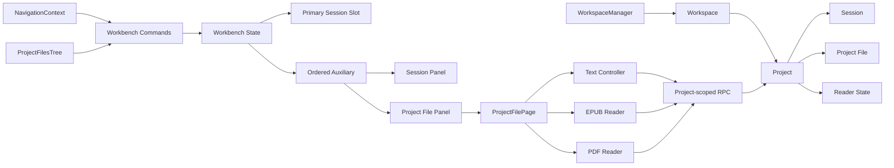
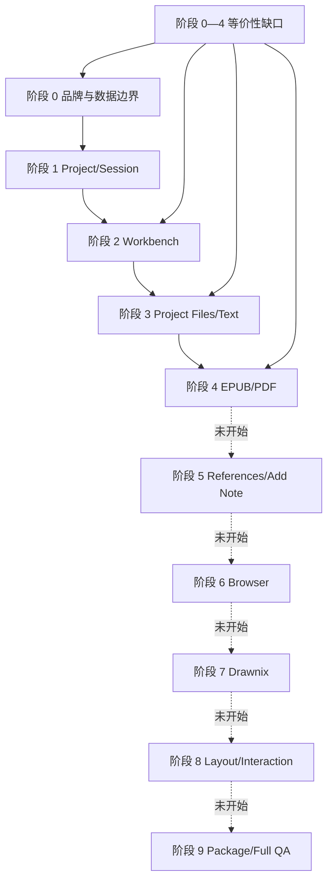
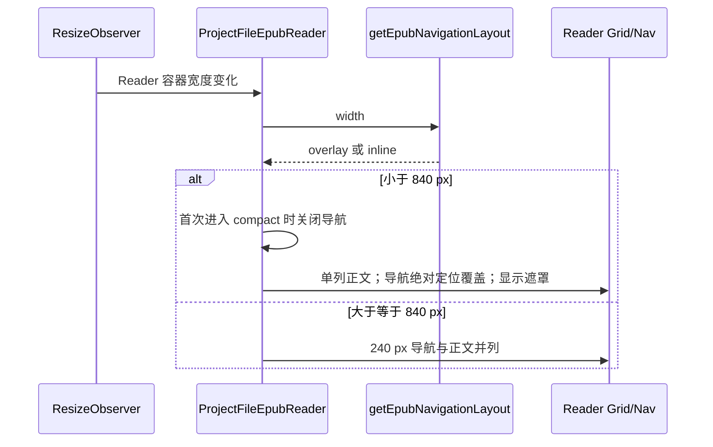

# Stair 阶段 0—4 当前实现地图

> 文档性质：这是 2026-08-21 修复前的实现快照，用于说明审计如何定位缺口。文中“缺失”“回归”均指审计当时；最终收口状态以 `docs/stair-rebuild-plan.md` 和 `docs/code-review/2026-08-21_13-52-33/review.md` 为准。

## 当前所有权

领域数据与展示状态的分离方向是正确的：Project/Session/File 身份不由 Panel 决定，Panel 也不负责持久化文档内容。本次 EPUB overlay 修复只位于 `EPUB Reader` 内，没有改变图中的边界。

## 能力到模块的映射

| 用户能力 | Renderer 入口 | 状态/命令 | 服务端/协议 | 当前状态 |
| --- | --- | --- | --- | --- |
| 新建 Workspace 与默认 Project | Workspace 创建流程 | Workspace config | shared workspace/project storage | 已实现；属于批准过的新语义 |
| 新建 Session 并绑定 Project | `NavigationContext`、AppShell | `showSessionInPrimaryAtom`、`openSessionPanelAtom` | SessionManager | 已实现；归属不可变 |
| 聚焦可见 Session Panel | Navigator Session item | `focusWorkbenchPanelAtom` + reveal revision | 无 | 已实现并真实验证 |
| 收起 Navigator | `TopBar`、`AppShell` | `navigatorVisible` 偏好 | 无 | 用户新增能力，已实现 |
| Project Files 侧栏 | `WorkspaceFilesSidebar`、`ProjectFilesTree` | 目录局部状态 | `projectFiles:LIST_DIRECTORY_ENTRIES` | 已实现基础树；搜索/创建缺失 |
| 普通文件 Preview | Project file click | `openProjectFilePreviewAtom` | read text/binary | 已实现唯一 Preview Auxiliary |
| 显式新文件 Panel | 文件右键 | `openProjectFilePanelAtom` | read text/binary | 已实现持久 Auxiliary |
| 文本编辑与自动保存 | `ProjectFilePage` | `project-text-document-controller`、document registry | compare-and-save RPC | 主链已实现；Save Draft As 与 Markdown link 回调缺失 |
| EPUB 阅读 | `ProjectFileEpubReader` | EPUB mutation coordinator | binary read + Reader State | 主链已实现；本轮恢复窄栏 overlay，仍缺部分旧交互 |
| PDF 阅读 | `ProjectFilePdfReader` | PDF mutation coordinator、虚拟页布局 | binary read + Reader State | 主链已实现；窄栏 overlay 与 pageLabels 缺失 |
| Draft | Chat 输入 | Session draft store | `settings.ts` draft RPC | 功能存在，但 Workspace 授权回归 |
| 空 Session 生命周期 | `NavigationContext` | 可见 Session 集合 | delete Session RPC | 旧统一清理路径缺失 |
| HMR 保持当前界面 | Renderer entry | Jotai Provider/React Root | 无 | 旧 Root 复用保护缺失 |
| Renderer 失败恢复 | 无 | BrowserWindow 生命周期 | `window-manager.ts` | 旧主框架过滤与完整 URL 恢复缺失 |

## 阶段边界与真实产品状态

阶段 5—9 的延期不能解释所有缺口。HMR、窗口恢复、Draft 授权、空 Session、Markdown 链接、Save Draft As、图片预览、PDF overlay 等都属于已经完成阶段应当覆盖、或计划没有承接的能力。

## EPUB 本轮修复调用链

阈值函数放在现有 Reader helper 中，只有 Reader 组件使用。没有新增依赖、全局状态、配置项或跨模块抽象。

## 仍需守住的架构停机线

- 不把 Reader 的 UI 状态放进 Workbench。
- 不为恢复旧能力重新引入旧 `PanelStack` 写路径。
- 不让 Navigation 直接修改 Panel 数组细节，只调用 Workbench command。
- 不让 Renderer 成为 Project 路径授权的最终权威。
- 不为兼容旧用户数据增加双 Schema 或迁移层。
- 如果某项修复必须改变以上所有权，先暂停并向用户确认。
